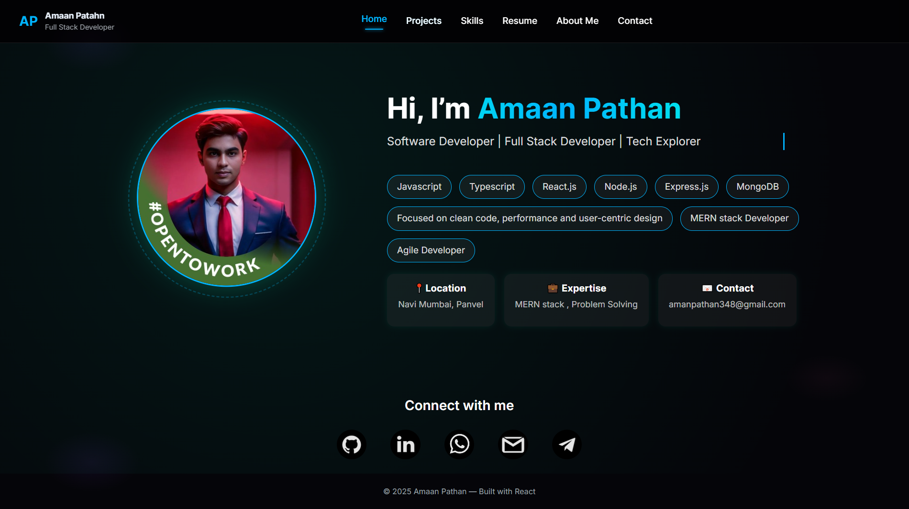

# Amaan Pathan Portfolio

A personal developer portfolio showcasing projects, skills, and contact
information. This portfolio is designed with a clean UI, smooth
interactions, and responsive layouts to highlight professional
experience and full‑stack development capabilities.

## 🚀 Features

-   **Modern UI/UX** with responsive design\
-   **Project showcase section** with detailed descriptions\
-   **Skills section** highlighting technical strengths\
-   **Contact section** with direct links\
-   **Smooth animations and transitions**\
-   **Fast and optimized performance**

## 🛠️ Tech Stack

-   **Frontend:** HTML, CSS, JavaScript, React\
-   **Styling:** Tailwind CSS\
-   **Build Tools:** Vite\
-   **Version Control:** Git & GitHub

## 📁 Project Structure

    Amaan-Pathan-Portfolio/
    │── public/
    │── src/
    │   ├── components/
    │   ├── assets/
    │   ├── pages/
    │── package.json
    │── vite.config.js
    │── README.md

## 📸 Preview


* Index page


* Project page


* About_me page


* Resume page


* Contact page


## 📦 Installation & Setup

``` bash
git clone https://github.com/amaanpathan2313/Amaan-Pathan-Portfolio
cd Amaan-Pathan-Portfolio
npm install
npm run dev
```

## 🔗 Live Demo

(Add deployed link if available.)

## 🤝 Contributing

Contributions are welcome!\
Feel free to fork this repo and submit a pull request.

## 📬 Contact

-   **GitHub:** amaanpathan2313\
-   **LinkedIn:** https://www.linkedin.com/in/amaan23\
-   **Email:**  amanpathan348@gmail.com
